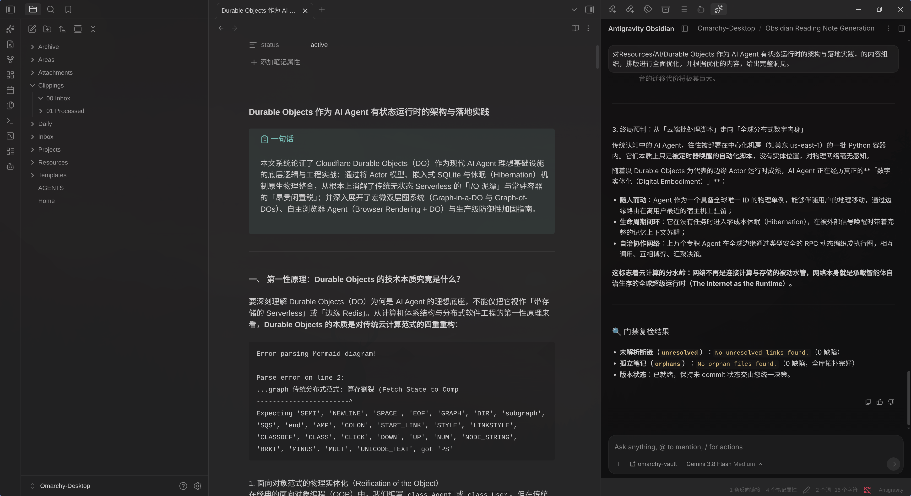
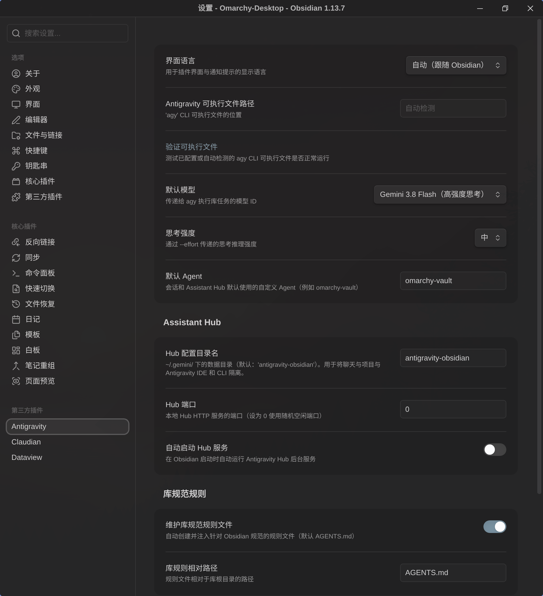

# Obsidian Antigravity

An Obsidian plugin that connects your vault to Google Antigravity's `agy` CLI, letting an agent read, reorganize, and maintain your notes.

Rather than wrapping Antigravity in a chat interface, this plugin exposes it as discrete vault tasks and an optional embedded web view. It builds on Antigravity's agentic filesystem access instead of a multi-provider chat framework.

English | [简体中文](README.zh-CN.md)



---

## Requirements

- **Desktop only.** The plugin spawns `agy` as a child process, so it cannot run on mobile.
- **The `agy` CLI must be installed and authenticated.** The plugin does not bundle or install it. Configure the binary path in settings if it is not in a standard location.

---

## Installation

### From the community plugins browser

Search for "Antigravity" under **Settings → Community plugins → Browse**, then install and enable it.

If it does not appear there yet, use a manual install instead.

### Manual install

1. Download `main.js`, `manifest.json`, and `styles.css` from the [latest release](https://github.com/kyc/obsidian-antigravity/releases).
2. Create the folder `<your-vault>/.obsidian/plugins/antigravity/`.
3. Place the three files inside it.
4. In Obsidian, enable the plugin under **Settings → Community plugins**.

### From source

```bash
git clone https://github.com/kyc/obsidian-antigravity.git
cd obsidian-antigravity
npm install
npm run build
```

`npm run build` writes the bundle to `main.js` in the repository root. Setting `OBSIDIAN_PLUGIN_PATH` additionally mirrors the three plugin files into that directory, which is useful for testing against a live vault. The sync is skipped when the variable is unset, and a failed copy warns without failing the build.

---

## Features

- **Discrete vault tasks** — Run refactoring, link auditing, frontmatter cleanup, and MOC generation from the command palette, without a conversational UI.
- **Embedded web hub** — Optionally open a tab running `agy --hub`, giving you the full Antigravity web UI (streaming thinking blocks, tool cards, multi-agent artifacts) inside Obsidian.
- **Vault context awareness** — The active note path, editor selection, or containing folder is extracted and passed to the agent automatically.
- **Status bar control** — A live status indicator with a spinner, click to cancel a running task.
- **Vault rules** — An `AGENTS.md` file is created and injected so the agent follows Obsidian conventions such as `[[wikilinks]]` and YAML frontmatter.
- **Permission gating** — Tasks run in restricted approval mode by default, and the assistant web hub passes no permission bypass to its daemon. Unrestricted autonomous execution is gated behind a setting, a separate confirmation for each of the two paths (one-off tasks, and hub sessions), and a persistent risk banner on results.

---

## Commands

All commands are available from the command palette and can be bound to hotkeys. Names follow Obsidian's sentence case convention.

| Command | ID | Description |
| :--- | :--- | :--- |
| Open assistant web hub view | `open-hub` | Opens the embedded webview tab running the Antigravity web hub. |
| Run task on active context | `run-task` | Opens the task dialog with a context badge (selection / note / vault) and action presets. |
| Fix wikilinks in active note | `fix-links` | Audits wikilinks, fixes broken ones, and suggests links for unlinked references. |
| Audit and clean frontmatter in active note | `audit-frontmatter` | Validates and standardizes YAML tags, aliases, and metadata without removing custom fields. |
| Build map of content (MOC) for current folder | `build-folder-moc` | Scans the folder and creates or updates a `_MOC.md` index note. |
| Stop current task | `stop-task` | Cancels the running `agy` process. |

The ribbon icon opens the hub. Right-click it, or hold <kbd>Alt</kbd> while clicking, for a menu with the task and stop actions instead.

---

## Configuration

Found under **Settings → Antigravity**.

**Language** — Interface language. Options are auto (follows Obsidian), English, Simplified Chinese, and Traditional Chinese.

**Antigravity binary path** — Location of the `agy` executable. When empty, the plugin searches `~/.local/bin`, `/usr/local/bin`, `/usr/bin`, and your `PATH`. The **Verify binary** button runs `agy --version` to confirm the plugin can execute it.

**Default model** — Model ID passed to `agy`. Run `agy models` to list the IDs your account can use. The dropdown offers `gemini-3.8-flash-high`, `gemini-3.8-flash-medium`, `gemini-3.8-flash-low`, `gemini-3.7-flash-high`, `gemini-3.7-flash-medium`, `gemini-3.7-flash-low`, `gemini-3.6-flash-high`, `gemini-3.6-flash-medium`, `gemini-3.6-flash-low`, `gemini-3.1-pro-high`, `gemini-3.1-pro-low`, `claude-sonnet-4-6`, `claude-opus-4-6-thinking`, and `gpt-oss-120b-medium`.

Reasoning intensity is part of the model ID itself. `agy` rejects a `--model` carrying an `-high` / `-medium` / `-low` suffix when `--effort` is also supplied ("conflicts with --effort"), so the plugin sets the level through the model choice alone and never passes `--effort`.

**Default agent** — Agent persona passed via `--agent`. Defaults to `omarchy-vault`.

### Assistant hub

- **Hub profile name** — Data directory under `~/.gemini/`, default `antigravity-obsidian`. This isolates the hub's conversations and projects from your Antigravity IDE and standalone CLI sessions.
- **Hub port** — Port for the local hub HTTP server. `0` picks a free port dynamically.
- **Auto-start hub server** — Start the hub daemon when Obsidian loads.

### Vault rules

- **Maintain vault rules file** — Create and inject a rules file describing Obsidian conventions.
- **Vault rules relative path** — Path relative to the vault root, default `AGENTS.md`. Paths resolving outside the vault fall back to `AGENTS.md`.

### Vault tasks & security

- **Allow unrestricted tasks** — Passes `--dangerously-skip-permissions` to auto-approve tool execution. Applies to **both** paths: background tasks (`agy --print`, headless) and the assistant web hub daemon (`agy --hub`, an interactive session). Each path asks for its own confirmation the first time it runs unrestricted. While disabled, dangerous operations are blocked in headless mode and reported as `denied_actions`. Note that toggling this setting restarts the hub daemon on the next open, which ends the current hub conversation.



---

## Security & privacy

- **Desktop only** — Node.js child processes are required, declared as `"isDesktopOnly": true` in `manifest.json`.
- **Profile isolation** — The hub daemon runs with `--app_data_dir=antigravity-obsidian`, so it cannot lock the database or collide with sessions in your primary Antigravity IDE.
- **Access to `~/.gemini/`** — To bootstrap the Antigravity web UI without a second interactive login, the plugin reads `~/.gemini/` to copy OAuth credentials (written with `0600` permissions) and to register a workspace JSON link for your vault.
- **No external network requests** — The plugin makes no outbound requests of its own. Its only HTTP call is a loopback health check against `127.0.0.1` to detect when the local hub is listening. All model traffic is handled by the `agy` process.
- **Path validation** — Profile names and rules paths are sanitized against traversal (`../`). Context paths embedded in prompts are resolved and confined to the vault.
- **Task permissions** — Tasks are restricted by default. The plugin does not silently auto-approve tool use.

---

## Development

```bash
npm run dev          # Watch mode with automatic rebuild
npm run build        # Production bundle to main.js and sync to vault
npm run typecheck    # Verify TypeScript types
npm test             # Run the Jest unit test suite (9 suites, 118 tests)
npm run lint         # Lint source files with eslint-plugin-obsidianmd
```

The full validation pipeline, also run by CI on every push and pull request:

```bash
npm run typecheck && npm test && npm run build && npm run lint
```

Unit tests mirror `src/` under `tests/unit/`. See [CONTRIBUTING.md](CONTRIBUTING.md) for commit conventions and code standards.

Additional documentation:

- [Architecture and development notes](docs/ARCHITECTURE_AND_DEV_NOTES.md)
- [Hub capability boundaries](docs/HUB_CAPABILITY_BOUNDARIES.md)
- [Code review notes](docs/CODE_REVIEW_2026-09.md)

---

## License

[MIT](LICENSE)
