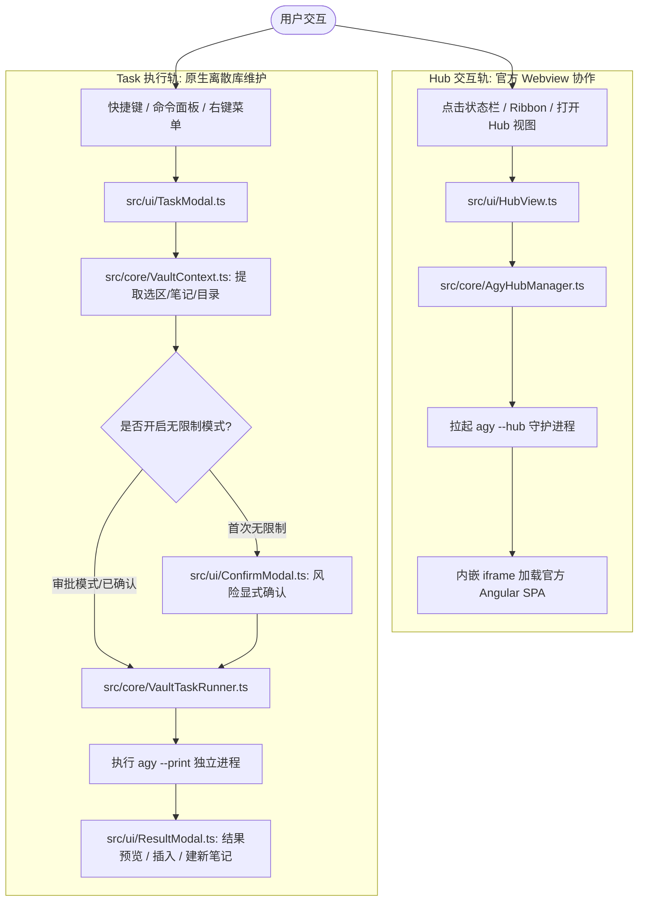

# Architecture and Development Notes (架构决策与开发参考)

本备忘录汇总了 `obsidian-antigravity` 插件的系统架构设计、底层逆向工程突破、并发与安全防范机制、以及符合 Obsidian 社区规范（`eslint-plugin-obsidianmd` v0.4.2）的技术实现，供后续开发与维护参考。

---

## 1. 项目演进与定位 (Evolution & Positioning)

- **演进背景**：原项目曾源自多 Provider 通用对话插件架构，包含大量 ACP 传输协议、复杂的会话状态持久化与多模型适配代码。
- **重构目标**：彻底剥离所有第三方 Provider 与历史技术债，针对 Google Antigravity (`agy`) 打造轻量、专注、原生的 Obsidian 知识库管理与 Agent 协作插件。
- **双轨定型**：经实测确证，`agy` CLI 的非交互流式模式存在天然能力边界（无官方前端的多 Agent 协同、思维链卡片与 Artifacts 系统）；因此插件彻底废弃了初期的原生侧边栏 Chat 轨道，全面聚焦于：
  1. **Hub 轨**：无缝内嵌官方 Web SPA，获得完整高阶智能体协作能力；
  2. **Task 轨**：原生离散单次任务运行器，提供一键式 WikiLinks 修复、Frontmatter 校验与 MOC 构建。

---

## 2. 双轨架构设计 (Two-Track Architecture)



### 2.1 官方 Web Hub 内嵌视图 (`HubView` + `AgyHubManager`)
- **实现原理**：通过 [src/core/AgyHubManager.ts](../src/core/AgyHubManager.ts) 在后台守护启动 `agy --hub` 服务进程，动态分配可用端口，以 Obsidian 原生标签页（`ItemView`）内嵌 `<iframe>` 呈现完整的 Antigravity 官方 Web 界面。
- **核心定位**：处理复杂多轮问答、思维链分析、多 Agent 协作流、Artifacts 交互式生成。
- **关键文件**：
  - [src/core/AgyHubManager.ts](../src/core/AgyHubManager.ts)
  - [src/ui/HubView.ts](../src/ui/HubView.ts)

### 2.2 离散任务执行器 (`TaskModal` + `ResultModal` + `VaultTaskRunner`)
- **实现原理**：针对 MOC 构建、未解析双链修复、Frontmatter 校验等单次明确任务，提供快捷模态框。底层通过 `agy --print <prompt> --output-format stream-json --add-dir <vaultPath>` 调用单次非交互进程。
- **生命周期隔离**：每次执行绑定独立的 `ActiveTaskRun` 句柄与单调递增的 `runId`，彻底杜绝已取消或旧进程延迟发送的 `'exit'` 事件污染后续任务。
- **审查与回显**：执行产物由 [src/ui/ResultModal.ts](../src/ui/ResultModal.ts) 进行 Markdown 渲染，支持一键复制、追加至当前笔记或创建新独立笔记。
- **关键文件**：
  - [src/core/VaultTaskRunner.ts](../src/core/VaultTaskRunner.ts)
  - [src/ui/TaskModal.ts](../src/ui/TaskModal.ts)
  - [src/ui/ConfirmModal.ts](../src/ui/ConfirmModal.ts)
  - [src/ui/ResultModal.ts](../src/ui/ResultModal.ts)

---

## 3. Antigravity Hub 关键突破与底层逆向记录 (Hub Critical Breakthroughs)

### 3.1 规避 Extension 桥接白屏悬挂
- **踩坑现象**：早期尝试使用 `/?extensionView=true`，内嵌 iframe 陷入无止境的空白加载状态。
- **根本原因**：`agy --hub` 前端源码在检测到 `extensionView` 时，会挂起渲染等待 VS Code RPC 握手信号。由于普通浏览器 iframe 无法提供该专有通道，前端路由死锁。
- **解决方案**：采用纯 Web 模式接入，URL 规范格式为：`http://127.0.0.1:${port}/?section=${projectId}&hostTheme=${theme}`，彻底剔除所有 extension 桥接参数。

### 3.2 并发防抖与跨 Profile 启动锁 (`inFlightStart` & `startMutex`)
- **踩坑现象**：多标签页或快速重连并发调用 `startHub` 时，可能出现进程竞争、端口冲突、旧进程被杀导致后发请求拿到残留旧 URL。
- **解决方案**：
  1. 相同 **Profile + Vault 组合**的并发请求通过 `inFlightStart` 合并，共享同一个 Promise（注意是单个对象而非按 profile 索引的 Map，仅保留最近一次 in-flight 启动）；
  2. 跨 Profile 切换由 `startMutex` 全局互斥锁串行化调度，锁内重新校验运行态，若已有进程属于不同 profile/vault 则先 `stopHub()`；
  3. 端口与进程状态在校验就绪后原子提交至实例属性；
  4. `stopHub()` 持有的 SIGKILL 兜底定时器会随下一次 `stopHub()` 取消，`AgyProcess.killProcess` 返回的句柄对其调用 `unref()`，避免该计时器独自阻止宿主进程退出。

### 3.3 Profile 数据隔离与路径遍历防御 (`sanitizeProfile`)
- **踩坑现象**：默认启动 `agy --hub` 会共用 `~/.gemini/antigravity-cli/`，与终端 CLI、Antigravity IDE 发生会话串扰、锁竞争和数据库冲突。
- **解决方案**：启动参数追加 `--app_data_dir=${hubProfile}`（默认值 `antigravity-obsidian`），将数据完全隔离在 `~/.gemini/antigravity-obsidian/`。
- **安全防范**：通过 `sanitizeProfile()` 剔除白名单 `[a-zA-Z0-9_-]` 之外的字符，消除利用 `../../` 逃逸出 `~/.gemini/` 写入越界凭据的路径遍历漏洞。注意实现是**剔除**而非「校验后拒绝」：非法字符被静默删除（`../../victim` → `victim`），空结果回退为 `antigravity-obsidian`。`types.ts` 的 `validateSettings` 另用锚定正则 `/^[a-zA-Z0-9_-]+$/` 对持久化设置做严格校验。

### 3.4 认证凭据自动同步 (`ensureProfileAuth`)
- **踩坑现象**：新建独立 Profile 目录后缺少 OAuth 凭据，前端每次启动均要求用户重新扫码/登录。
- **解决方案**：在 Hub 启动前，`ensureProfileAuth` 自动自 `~/.gemini/antigravity-cli/` 检索 `antigravity-oauth-token`，并以严格安全权限（`0600`）复制至新 Profile 目录下。

### 3.5 破解 `/onboarding` 状态悬挂死循环 (`ensureProfileOnboarding`)
- **踩坑现象**：即使认证凭证有效，前端仍被强制重定向至 `/onboarding`，界面定格在 `Success, Continuing...` 无法进入主界面。
- **根本原因**：`main.js` 路由守卫检查 `c.hasOnboardingScreens && e !== 2`。新 Profile 目录下的 `antigravity_state.pbtxt` 缺失完成标记，导致路由守卫无限拦截根路径 `/`。
- **解决方案**：`ensureProfileOnboarding` 在服务启动前，向 `antigravity_state.pbtxt` 预置完整状态。注意 `post_onboarding` 是**嵌套消息**，完成步骤以重复字段 `completed_steps` 列出——不存在 `post_onboarding_step_completed` 这样的扁平字段名：
  ```protobuf
  post_onboarding:  {
    completed_steps:  POST_ONBOARDING_STEP_TYPE_MANAGER_WELCOME
    completed_steps:  POST_ONBOARDING_STEP_TYPE_USAGE_MODE
    completed_steps:  POST_ONBOARDING_STEP_TYPE_AGENT_CONFIGURATION
    completed_steps:  POST_ONBOARDING_STEP_TYPE_ADD_WORKSPACE
  }
  agent_onboarding_completed:  AGENT_ONBOARDING_STATE_COMPLETED
  migrate_convos_into_projects:  MIGRATION_STATUS_COMPLETED
  ```
  完整字面量（含 `seen_nuxs` 与 `migrations` 键）见 `src/core/AgyHubManager.ts` 的 `ensureProfileOnboarding`。写入采用「读-改-写」：仅当既有内容不含 `AGENT_ONBOARDING_STATE_COMPLETED` 时才补齐，已有完成标记的文件原样保留。

### 3.6 项目自动注册与哈希防碰撞 (`ensureVaultProject`)
- **踩坑现象**：绕过 Onboarding 后，Webview 提示 "No Project"，无法读写 Vault 文件。此外不同路径下相同目录名的 Vault 会映射为同一个项目 ID 导致配置覆盖。
- **解决方案**：
  1. `ensureVaultProject(vaultPath)` 计算标准化绝对路径的 8 位 SHA256 哈希，生成全局唯一项目 ID `obsidian-${cleanName}-${hash}`；
  2. 自动写入 `~/.gemini/config/projects/${projectId}.json`，将 `file://${vaultPath}` 注册为工程资源；
  3. `ensureDefaultProjectId` 在 profile cache 写入 `default_project_id.txt`；
  4. `getHubUrl` 自动拼接 `?section=${projectId}`，启动参数追加 `--project=${projectId} --add-dir=${vaultPath}`。

---

## 4. 安全防护与上下文注入机制 (Security & Prompt Layering)

### 4.1 权限控制与自动化执行安全门禁
- **默认受限模式**：`agy --print` 默认**不携带** `--dangerously-skip-permissions`，处于 `request-review` 状态。非交互命令行下，任何试图越权执行 Shell 命令或未授权修改的 Tool Call 会被底层自动拦截，并在返回结果中追加 `[!WARNING] Restricted Execution` 提示。Hub 轨同理：`startHub()` 仅在开关开启时才追加该 flag。
- **无限制模式双重确认**：只有在设置中显式开启 `allowUnrestrictedTasks`，且通过 [src/ui/ConfirmModal.ts](../src/ui/ConfirmModal.ts) 明确确认提示注入（Prompt Injection）与破坏性文件风险后，才允许向 CLI 注入 `--dangerously-skip-permissions`。
- **两条路径独立确认**：该开关同时作用于 Task 轨与 Hub 轨，但两者的确认**彼此独立**（`unrestrictedConfirmed` 与 `hubUnrestrictedConfirmed`）。原因是 Hub 是**交互式持续会话**：一次确认覆盖该会话存续期间的**全部**工具调用，风险面显著大于一次性任务，因此不能由任务轨的确认顺带授权。Hub 的确认文案同时说明「切换该设置会重启 daemon 并终止当前会话」。
- **常驻风险警示**：无限制模式下生成的所有结果，在 [src/ui/ResultModal.ts](../src/ui/ResultModal.ts) 顶部以常驻醒目标识 `.antigravity-risk-banner` 进行风险披露。该横幅的**文字色刻意不使用** `--text-error`：在将两个 error token 映射为同一色相的主题（如 Omarchy）下，「红底 + 红字」会使横幅退化为一块不可读的空白色块。

### 4.2 规则路径与提示词路径净化
- **规则路径越界拦截**：[src/core/VaultContext.ts](../src/core/VaultContext.ts) 的 `resolveSafeRulesPath` 严格校验解析后的绝对路径必须以 `vaultPath + path.sep` 开头。若检测到 `../../` 等跨库逃逸路径，立即触发 Obsidian `Notice` 警告并强制回退至根目录默认值 `AGENTS.md`。
- **提示词上下文净化**：`sanitizeContextPath` 在生成发送给模型的 Prompt 前，对 `filePath` 与 `folderPath` 进行边界归一化，防止库外路径泄露至提示词中。

### 4.3 提示词三层叠加原理 (Prompt Layering)
LLM 在响应时会由底层到表层合并以下上下文：
1. **全局层**：`~/.gemini/config/GEMINI.md`（全局规范） + `~/.gemini/config/skills/`；
2. **工作区层**：Vault 根目录 `AGENTS.md`（工作区守则，由 `ensureVaultRules` 在缺失时安全创建，`agy` 原生读取一次，插件不重复拼接）；
3. **Agent 人设层**：选定的 `agent.md`（如 `omarchy-vault`，通过 `--agent` 注入）。

### 4.4 严格运行时配置校验 (`validateSettings`)
- 在 [src/types.ts](../src/types.ts) 中实现严格的纯函数校验，防止外部手动编辑 `data.json` 引入畸形类型（如字符串端口、非枚举 `effort`、带路径遍历的 `hubProfile`），保证所有运行时属性的绝对类型安全与边界兜底。

---

## 5. 项目文件映射 (Codebase Structure)

```text
obsidian-antigravity/
├── src/
│   ├── main.ts                        # 插件主入口、生命周期控制、命令与视图注册
│   ├── types.ts                       # 核心类型契约、设置接口及 validateSettings 校验器
│   ├── core/
│   │   ├── AgyProcess.ts              # 底层进程孵化封装 (child_process / 环境变量增强)
│   │   ├── AgyResolver.ts             # agy 可执行文件跨平台探测与版本校验
│   │   ├── AgyHubManager.ts           # agy --hub 守护进程、Profile 认证、Onboarding 及项目注册管理
│   │   ├── VaultContext.ts            # Obsidian 笔记/选区/目录上下文提取、路径净化与规则维护
│   │   └── VaultTaskRunner.ts         # 单次独立任务运行器 (agy --print, 生命周期与权限控制)
│   ├── i18n/
│   │   ├── index.ts                   # 语言解析 (getLanguage 探测 + 手动覆盖) 与 t() 插值
│   │   ├── types.ts                   # TranslationKey 联合类型与 LocaleDictionary 契约
│   │   └── locales/                   # en / zh-cn / zh-tw 三份类型安全字符串目录
│   ├── settings/
│   │   └── AntigravitySettingTab.ts   # 声明式插件配置面板 (1.13+ getSettingDefinitions)
│   └── ui/
│       ├── HubView.ts                 # Webview 内嵌 Tab 视图 (ItemView, 原生 Action 按钮)
│       ├── StatusBarItem.ts           # 状态栏指示器、动态 Spinner 与点击取消
│       ├── TaskModal.ts               # 离散任务执行模态框与上下文动作预设
│       ├── ConfirmModal.ts            # 危险操作（无限制自主执行）二次确认模态框
│       └── ResultModal.ts             # 任务执行产物审查模态框 (Markdown 渲染 / 风险标识 / 一键操作)
├── tests/
│   ├── __mocks__/obsidian.ts          # 完备的 Obsidian API 模拟层
│   ├── setupWindow.ts                 # jsdom 环境与 Obsidian DOM 辅助方法垫片
│   └── unit/                          # 完整 Jest 单元测试套件 (8 suites, 120 tests)
│       ├── core/                      # AgyHubManager, VaultContext, VaultTaskRunner, AgyResolver, AgyProcess
│       ├── ui/                        # StatusBarItem 测试
│       ├── i18n.test.ts               # 语言解析与插值测试
│       └── settings.test.ts           # 运行时配置类型与边界测试
├── docs/
│   ├── ARCHITECTURE_AND_DEV_NOTES.md  # 本文档 (系统架构、避坑要点与演进记录)
│   ├── HUB_CAPABILITY_BOUNDARIES.md   # 官方 Antigravity Hub 逆向调查与协议边界分析
│   └── CODE_REVIEW_2026-09.md         # 历史评审快照 (描述 Chat 轨时代的代码，行号已失效)
├── esbuild.config.mjs                 # 打包配置 (原生 node:module 导入，构建自动同步至目标 Vault)
├── manifest.json                      # Obsidian 插件元数据清单 (1.13.0+, isDesktopOnly)
└── package.json                       # 依赖与校验脚本配置
```

---

## 6. 开发、测试与持续集成守则 (Development Guidelines)

1. **执行验证流水线**：
   任何代码变更必须保证四项流水线全部全绿：
   ```bash
   npm run typecheck && npm test && npm run build && npm run lint
   ```
2. **零生产控制台输出**：
   严禁在 `src/` 生产代码中使用 `console.*`。用户通知使用 `new Notice()`，失败情况抛出类型化 Error。
3. **样式与无障碍守则**：
   - 严禁使用内联样式，统一在 `styles.css` 中基于 Obsidian CSS 变量编写；
   - 严禁使用 `!important` 与 `:has()` 选择器；
   - 所有交互输入框必须提供 `:focus-visible` 轮廓指示器；
   - 所有 UI 文本必须严格遵循 Sentence Case（句子首字母大写）。
4. **安全与隔离承诺**：
   - 敏感凭据（如 `antigravity-oauth-token`）强制使用 `0600` 权限；
   - 保留 Profile 隔离机制，不污染宿主机默认 CLI 会话；
   - 任务自主执行权限（`--dangerously-skip-permissions`）必须经过显式确认。

---

## 7. 社区规范查核与架构评估 (Community Standards & Scorecard Audit)

本插件经过官方 `obsidian` skill 与 `eslint-plugin-obsidianmd`（v0.4.2）社区扫描规则集全面检验，实现了 **0 错误、0 警告**：

| 评估维度 | 规范要求 | 插件落地实现 | 状态 |
| :--- | :--- | :--- | :--- |
| **Manifest & 命名** | 无 "obsidian" / "plugin" 冗余词，描述句末带标点 | `id: "antigravity"`, `name: "Antigravity"`，描述合规 | ✅ 完美合规 |
| **类型安全** | 严禁 `any` 侵染，使用 `instanceof` 收窄 | 定义精确的 `StreamEvent`、`StreamResult` 接口，无类型盲区 | ✅ 完美合规 |
| **多窗口 (Popout)** | 避免裸 DOM 与裸计时器 | 定时器使用 window 作用域，UI 视图绑定 `activeWindow` | ✅ 完美合规 |
| **生命周期** | 无未清理监听器，不手动销毁 Leaves | 全部 DOM 监听绑定 `registerDomEvent`，无冗余 leaf detach | ✅ 完美合规 |
| **1.13+ 声明式设置** | 实现 `getSettingDefinitions`，移除 `display` | 纯声明式配置，设置项支持全局搜索索引 | ✅ 完美合规 |
| **无障碍 (A11y)** | 键盘可达，`:focus-visible` 高亮，按钮语义化 | 配置 2px 主题外边框与偏移，按钮全部显式声明 `type="button"` | ✅ 完美合规 |
| **依赖安全** | 不使用已废弃/可替代包，无 CVE 风险 | 移除 `builtin-modules`，全面使用原生 `node:module` | ✅ 完美合规 |
